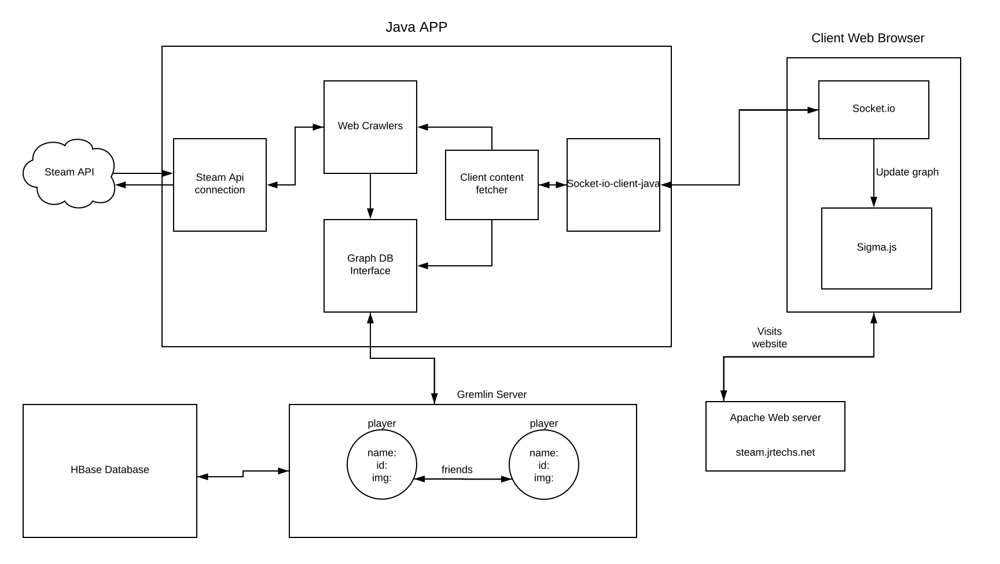
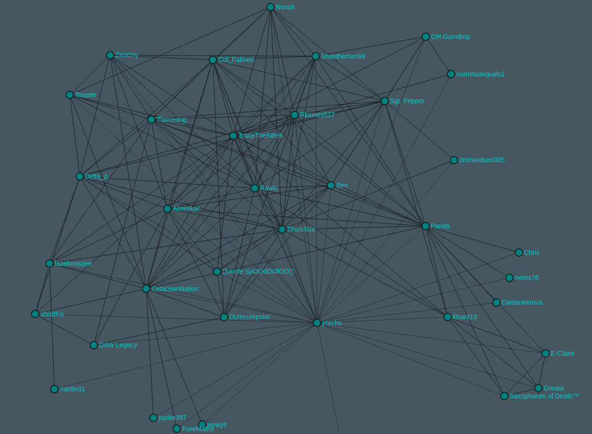

# Steam Graph Analysis

This is a project that I threw together during the weekend to play around with
gremlin graph database. Currently this project scrapes the steam API for friends
and their friends which can be used to generate a graph. This information is stored
locally in a gremlin server and is then sent to the client via a web socket. 

[Video Of Friends of Friends Graph](https://www.youtube.com/watch?v=DoDaHmyIPvQ)

This project is in the VERY early stages of development and is far from finished.
If you are lucky, you will find it live at [http://steam.jrtechs.net](http://steam.jrtechs.net).
It is still being actively developed and does not have permanent hosting so there is a %60
chance at any time that you will be able to access it. 

## Running this Project
* First you need to obtain a steam api key from [https://steamcommunity.com/dev/apikey](steam's website).
* Place the api key in the SteamAPIKey.json file under the conf/ folder.
* Spin up a local gremlin server to connect to.
* Install and configure Maven if you don't already have it installed.
* Run the App.java class either in a java IDE which supports maven (for dependencies), or build this
project into a jar and run it. I have a buildJar.sh which builds a jar file to use -- please note that
you still need to have maven installed. There is also a run.sh file which will run the jar file once
you place it in the same directory as the run script.
* Open graphs.html under the website/ folder in your web browser.

# TODO
* Include a steam name to steam id lookup
* Dockerize this entire environment
* Connect the gremlin/janus server to a HBase server for persistent storage
* Make the graphs look better -- possibly switch from sigma.js to d3
* Get the java web socket to work with ssh -- currently does not work with wss
* Make more graphs to provide more insights
    * Friends with friends -- shows which of your friends are friends with each other
    * Most common friends friends -- will show you people you may know
    * Graph of a larger chunk of the steam community
    * ...
* Write more documentation on how the system as a whole works.
* Write blog post on what I learned during this project.    